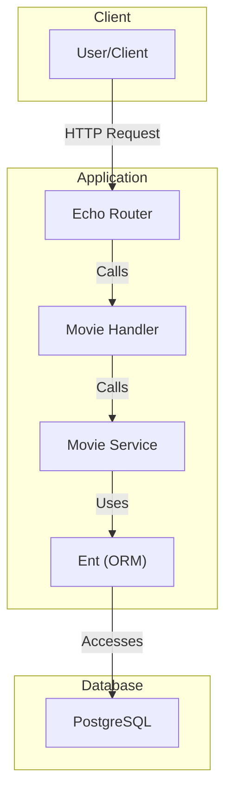
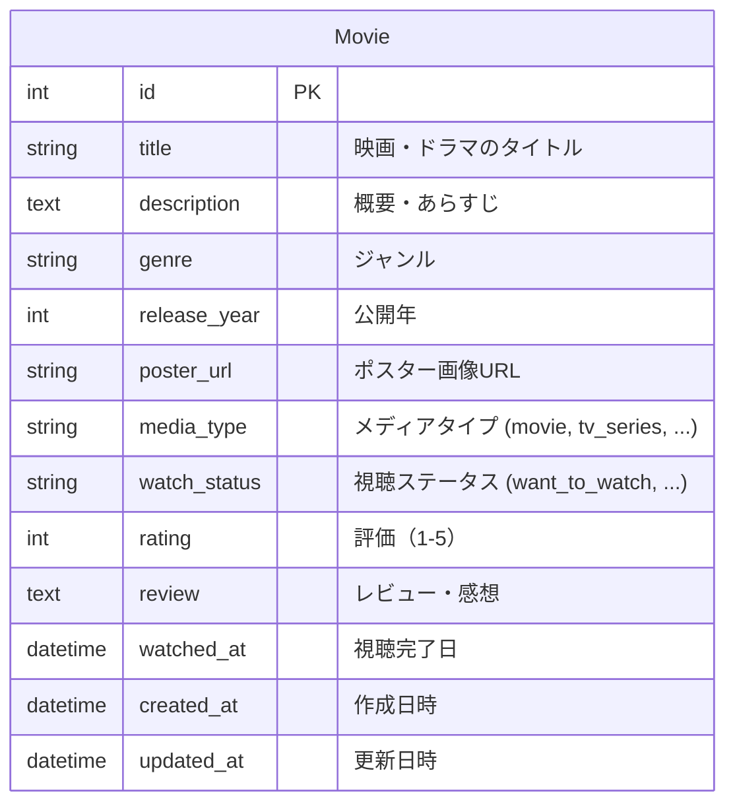

# Watchlist App

## 概要

`Watchlist App`は、映画やドラマなどの視聴作品を管理するための Web アプリケーションです。見たい作品、視聴中の作品、視聴済みの作品などを記録し、評価やレビューを追加することができます。

## 機能

- **作品情報の登録・一覧取得・詳細取得・更新・削除 (CRUD)**
- **ジャンル別統計情報の取得**
- **視聴ステータス別統計情報の取得**

### API エンドポイント

| メソッド | パス                   | 説明                     |
| :------- | :--------------------- | :----------------------- |
| `POST`   | `/api/v1/movies`       | 新しい作品を登録します   |
| `GET`    | `/api/v1/movies`       | 作品一覧を取得します     |
| `GET`    | `/api/v1/movies/:id`   | 特定の作品を取得します   |
| `PUT`    | `/api/v1/movies/:id`   | 作品情報を更新します     |
| `DELETE` | `/api/v1/movies/:id`   | 作品を削除します         |
| `GET`    | `/api/v1/stats/genres` | ジャンル一覧を取得します |
| `GET`    | `/api/v1/stats/watch`  | 視聴統計を取得します     |

## 技術スタック

- **言語**: Go
- **Web フレームワーク**: Echo
- **ORM**: Ent
- **データベース**: PostgreSQL
- **コンテナ**: Docker, Docker Compose


## 環境構築手順

1.  **リポジトリのクローン**

    ```bash
    git clone https://github.com/your-username/go-watch-list.git
    cd go-watch-list
    ```

2.  **環境変数の設定**
    ルートディレクトリに`config.yml`ファイルを作成し、以下の内容を記述します。

    ```yaml
    server:
      host: "localhost"
      port: "8000"

    database:
      user: "watchlist_user"
      password: "watchlist_pass"
      name: "watchlist"
      host: "localhost"
      port: 5435

    app:
      environment: "development"
    ```

    また、`docker-compose.yml`で利用する環境変数を定義するために、`.env`ファイルを作成します。

    ```.env
    DB_USER=watchlist_user
    DB_PASSWORD=watchlist_pass
    DB_NAME=watchlist
    DB_HOST=db
    DB_PORT=5432

    PGADMIN_DEFAULT_EMAIL=admin@example.com
    PGADMIN_DEFAULT_PASSWORD=admin
    ```

3.  **Docker コンテナの起動**
    以下のコマンドを実行して、PostgreSQL と pgAdmin のコンテナを起動します。

    ```bash
    make docker-up
    ```

4.  **開発ツールのインストール**
    開発に必要なツールをインストールします。

    ```bash
    make install-tools
    ```

5.  **開発サーバーの起動**
    以下のコマンドで開発サーバーを起動します。ホットリロードが有効になっています。

    ```bash
    make dev
    ```

    サーバーは `http://localhost:8080` で起動します。

## プロジェクト構成図



## ER 図



## ディレクトリ構成

```
.
├── cmd/server/main.go # アプリケーションのエントリポイント
├── docker-compose.yml # Docker Compose設定
├── dto/               # データ転送オブジェクト
├── ent/
│   ├── schema/        # データベーススキーマ定義
│   └── ...            # Ent (ORM) によって自動生成されるコード
├── go.mod
├── go.sum
├── internal/
│   ├── handler/       # HTTPリクエストの処理
│   ├── router/        # ルーティング設定
│   └── service/       # ビジネスロジック
├── Makefile           # 開発用コマンド
├── pkg/
│   ├── config/        # 設定の読み込み
│   ├── database/      # データベース接続
│   └── validator/     # バリデーション
└── README.md
```

## ライセンス

This project is licensed under the MIT License.
